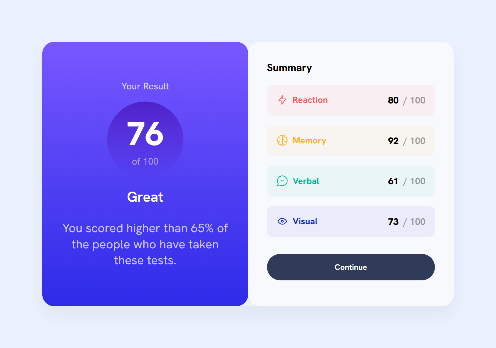

# Frontend Mentor - Results Summary Component

This is a solution to the [Results Summary Component challenge on Frontend Mentor](https://www.frontendmentor.io/challenges/results-summary-component-CE_K6s0maV). It helped me improve my HTML and CSS skills while focusing on layout and responsiveness.

## 📸 Screenshot

## 🔗 Links

- Live Site URL: [Blog Preview Card - Live](https://telmomanduco.github.io/results-summary-component/
)
- Solution on Frontend Mentor: [Frontend Mentor Preview Card - Live](https://www.frontendmentor.io/solutions/blog-preview-card-built-with-flex-crHkcCzpqK)

## 🛠 Built With

- Semantic HTML5
- CSS3 (no frameworks)
- Flexbox
- Responsive design with media queries
- Font: [Hanken Grotesk](https://fonts.google.com/specimen/Hanken+Grotesk)

## 🙋‍♂️ Author

- GitHub: [@TelmoManduco](https://github.com/TelmoManduco)
- Frontend Mentor: [@TelmoManduco](https://www.frontendmentor.io/profile/TelmoManduco)